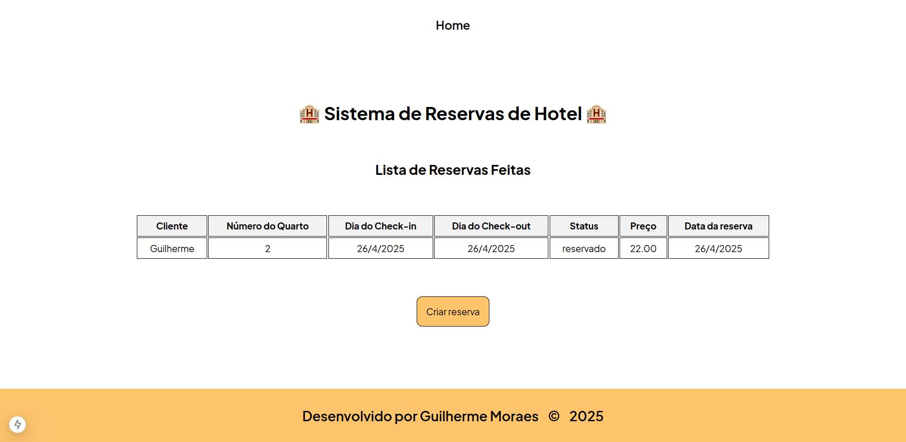
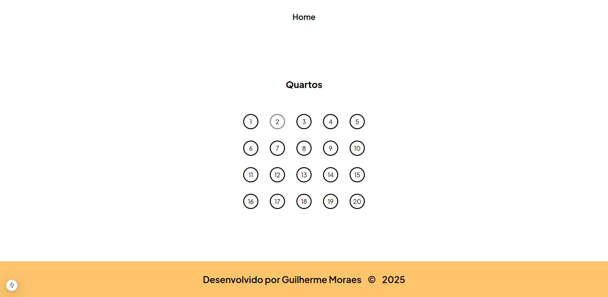
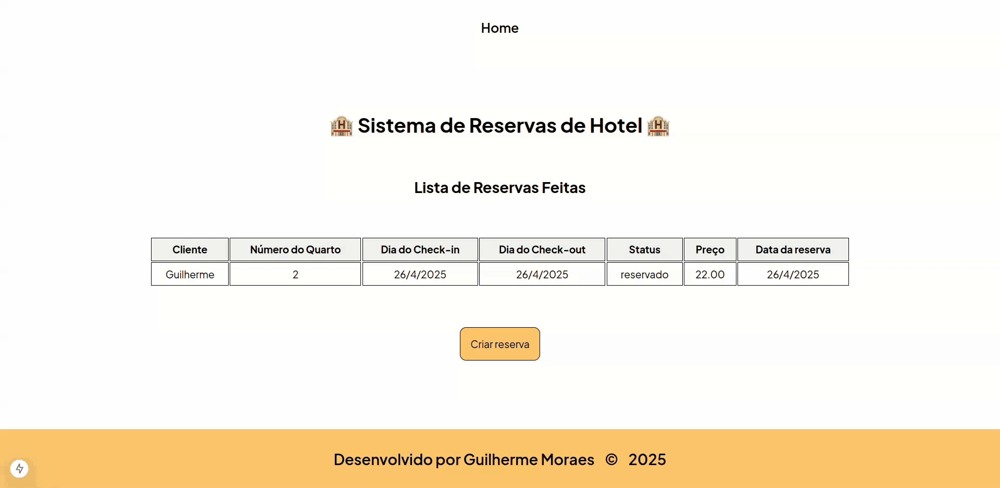

# 🏨 Gerenciador de Reservas de Hotel - Projeto Fullstack

Sistema de Gerenciamento de Reservas de Hotel criado com Next.js no frontend e Laravel no backend.

## 🛠️ Tecnologias Utilizadas 

- Front-end: Next.js (React)
- Back-end: Laravel (PHP)
- Banco de dados: PostgreSQL + Docker Compose

## ✨ Funcionalidades

- Visualizar reservas feitas



- Criar reserva





> Você seleciona o quarto, e a descrição do quarto é exibida.

## ⚙️ Instalação

### 1. Pré-requisitos

- NPM ou Yarn
- Docker
- PHP (versão: 8.2)
- Composer (versão: 2.8.8)

### 2. Configurando o back-end (Laravel)

Clone o repositório:

```bash
git clone https://github.com/guighm/hotel-booking-app-laravel.git

cd hotel-booking-app-laravel
```

Copie as variáveis de ambiente:

```bash
cp .env.example .env
```

Instale as dependências:

```bash
composer install
```

Rode o banco de dados: 

```bash
docker-compose up -d
```

Aplique as migrações e o seed:

```bash
php artisan migrate

php artisan db:seed
```

Rode a aplicação:

```bash
composer run dev
```

### 3. Configurando o front-end (Next.js)

Clone o repositório:

```bash
git clone https://github.com/guighm/hotel-booking-app-react.git
```

Acesse a pasta `hotel-booking-app-react`:

```bash
cd hotel-booking-app-react
```

Instale as dependências:

```bash
npm install 
# ou 
yarn install
```

Crie um arquivo `.env` e copie o seguinte conteúdo nele:

```
NEXT_PUBLIC_API_URL=http://localhost:8000
```

Inicie o front-end:

```bash
npm run dev 
# ou
yarn dev
```

O front-end estará disponível em:

```
http://localhost:3000
```

## 👨‍💻 Autor

<table>
  <tr>
    <td align="center">
    <a href="https://github.com/guighm">
        <br />
        <sub><b>Guilherme Moraes</b></sub>
        </a>
    </td>
  </tr>
</table>